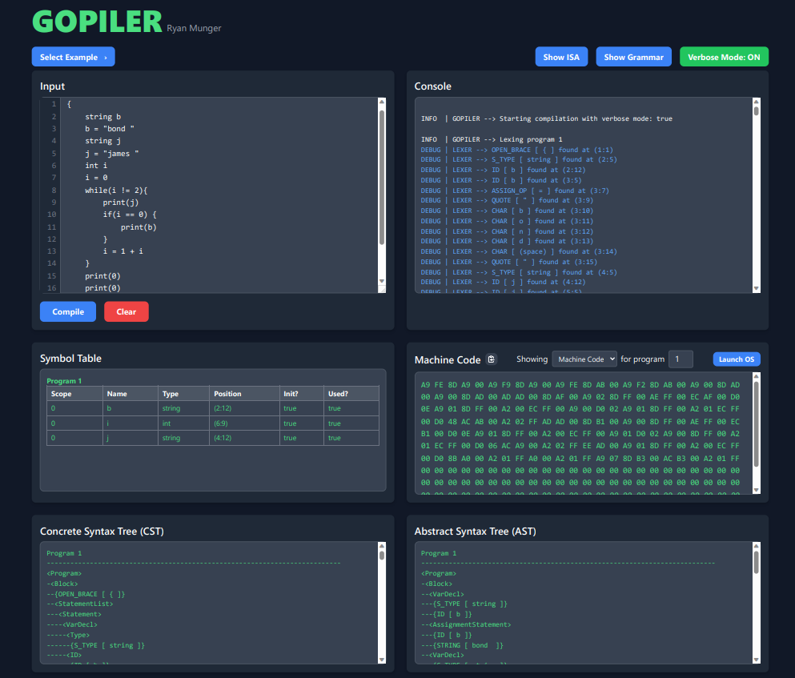

# Gopiler by Ryan Munger
This project is a compiler for a LL(1) language described in language_grammar.pdf. It compiles this language to a version of the MOS 6502 instruction set. It is a multi-pass compiler consisting of a lexer, recursive descent parser, semantic analyzer, and code generator as seen below. Happy compiling! 
   

# Setup
1. Get GoLang from your package manager or their website.
1. Ensure `go version` works.
1. Do not worry about dependencies as go run will handle everything.
1. **Gopiler has two modes of operation:**
   1. Web Mode
   2. CLI Mode

# Running Gopiler in Web Mode
1. This creates a frontend for the compiler! Using go made this VERY easy!!!
1. Note: commands to follow are to be run from the project directory.
2. Start webserver: `go run ./cmd/web/main.go`
   1. Add -e (expose) if you wish to open server to the internet (instead of localhost)
   2. As always, -h or -help will provide this information.
3. Simply enter your code and hit compile! You can view both the machine code and the assembly.

# Running Gopiler in CLI Mode
1. Note: commands to follow are to be run from the project directory.
2. **To compile and run (recommended):** `go run ./cmd/cli/main.go -f <filename>` 
    1. The -f arg provides the source file to compile.
    2. -t toggles terse mode (to hide detailed output).
    3. As always, -h or -help will provide this information.
3. To compile an executable:
    1. You can create a bin folder. Or be messy if you want.
    2. Linux: `go build -o ./bin/gopiler ./cmd/cli/main.go`
        1. Then: `./bin/gopiler -f <filename>`
    3. Windows: `go build -o ./bin/compiler.exe ./cmd/cli/main.go`
        1. Then: `.\bin\gopiler.exe -f <filename>`

# In this course I:
* Gained and demonstrated an understanding of the fundamental areas of compiler
architecture: front end, intermediate representation, and the back end.
* Gained and demonstrated an understanding of context-free grammars and their use.
* Gained and demonstrated an understanding of the techniques for scanning (lexical
analysis), parsing a grammar, translation, and simple code generation.
* Embraced the opportunity to develop a complex system over the course of the
semester where I have to either live with my prior mistakes and shortcuts or go
back and fix them. (Both teach valuable lessons) 
* Learned that developing the software is only half the battle, debugging and testing are
critical skills for a talented professional, and skills that will be valuable. 
* Gained and demonstrated an understanding that the chasm between programs that
work once and programs that work every time is ridiculously huge.
* Enhanced my continuing education skills. Capable problem solvers never stop
learning. 
